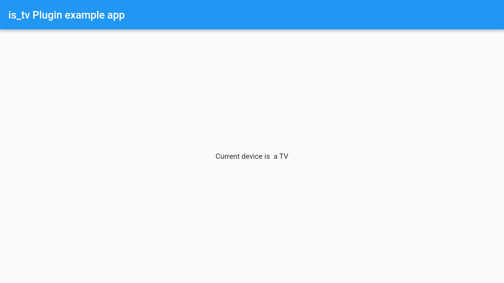
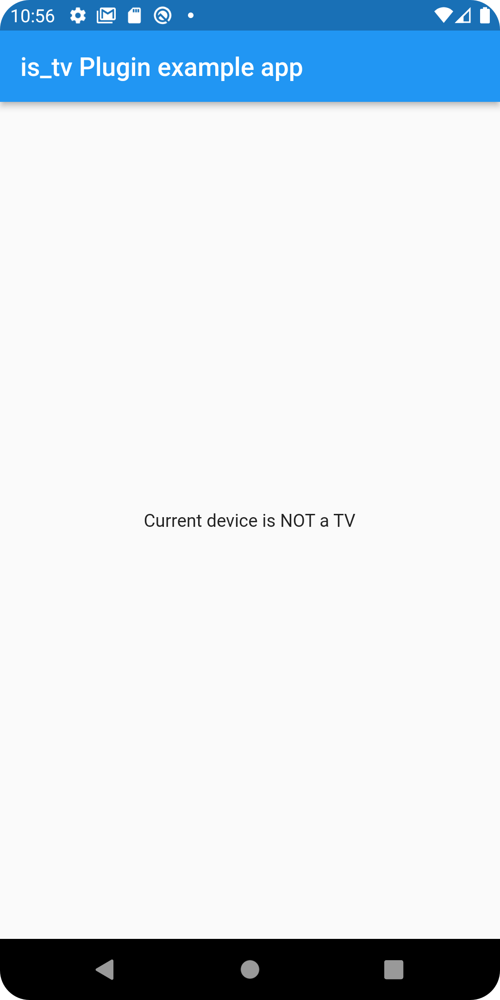

# is_tv

Flutter plugin to check if current device is a Television.

## Getting Started

### Installation

```
flutter pub add is_tv
```

### Preview




### Usage
```
import 'package:flutter/material.dart';
import 'dart:async';

import 'package:flutter/services.dart';
import 'package:is_tv/is_tv.dart';

void main() {
  runApp(const MyApp());
}

class MyApp extends StatefulWidget {
  const MyApp({Key? key}) : super(key: key);

  @override
  State<MyApp> createState() => _MyAppState();
}

class _MyAppState extends State<MyApp> {
  bool? _isTV;
  final _isTVPlugin = IsTV();

  @override
  void initState() {
    super.initState();
    initPlatformState();
  }

  Future<void> initPlatformState() async {
    bool? isTV;

    try {
      isTV = await _isTVPlugin.check() ?? false;
    } on PlatformException {
      isTV = false;
    }

    if (!mounted) return;

    setState(() {
      _isTV = isTV ?? false;
    });
  }

  @override
  Widget build(BuildContext context) {
    return MaterialApp(
      home: Scaffold(
        appBar: AppBar(
          title: const Text('is_tv Plugin example app'),
        ),
        body: Center(
          child:
              Text('Current device is ${(_isTV ?? false) ? "" : "NOT"} a TV'),
        ),
      ),
    );
  }
}

```


### Licence
Apache License 2.0